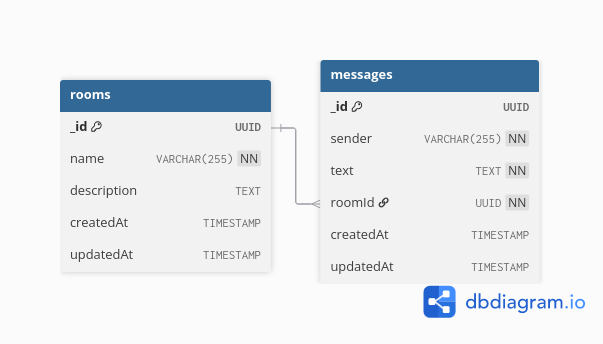

# NestJS WebSocket Chat App

Real-time chat application with NestJS, WebSocket (Socket.IO), and MongoDB (Mongoose).

## Features

- Real-time messaging with WebSocket
- Room-based chat (create, edit, delete rooms)
- Sleep/Wake system (auto-disconnect after 20s inactivity) **
- REST API for room management
- MongoDB for data persistence

## Prerequisites

- Node.js
- Docker (for MongoDB)

## Installation

```bash
# 1. Install dependencies
npm install

# 2. Setup environment variables
cp .env.example .env

# 3. Start MongoDB with Docker
docker-compose up -d   
or
docker compose up -d 

# 4. Start the application
npm run start:dev
```

## Environment Variables

Create `.env` file (copy from `.env.example`):

```env
PORT=3000
MONGODB_URI=mongodb://localhost:27017/chat-db
```

## API Endpoints

### REST API - Room Management

| Method | Endpoint     | Description      |
|--------|--------------|------------------|
| POST   | /room        | Create new room  |
| GET    | /room        | Get all rooms     |
| GET    | /room/:id    | Get room by ID    |
| PATCH  | /room/:id    | Update room       |
| DELETE | /room/:id    | Delete room       |

### WebSocket Events

| Event           | Direction | Description                     |
|-----------------|-----------|---------------------------------|
| joinRoom        | Client→   | Join a chat room                |
| joinedRoom      | Server→   | Confirmation of joining         |
| loadOldMessages | Server→   | Load previous messages (5 max)   |
| chatToServer    | Client→   | Send message {sender, roomId, text} |
| chatToClient    | Server→   | Receive message                 |

## Usage

1. Open `index.html` in browser (or serve it via NestJS static files) or use `bun ./index.html`
2. Enter your username
3. Create or join a chat room
4. Start chatting!


## Development


# Development mode (with hot reload)
npm run start:dev

## Database



Uses MongoDB with Mongoose. Collections:
- **rooms** - Chat rooms (name, description)
- **messages** - Messages (sender, text, roomId)

## Tech Stack

- NestJS
- Socket.IO
- Mongoose
- MongoDB
